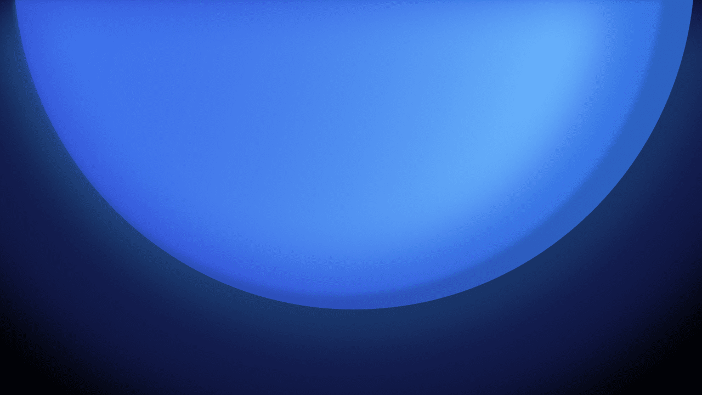
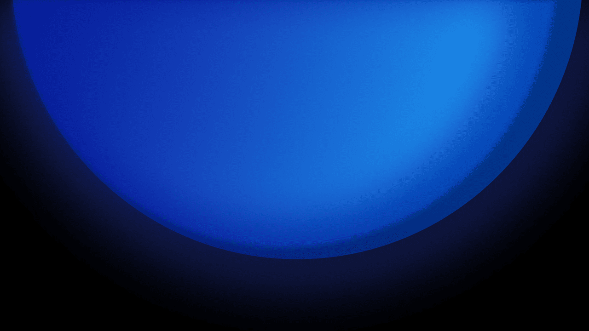
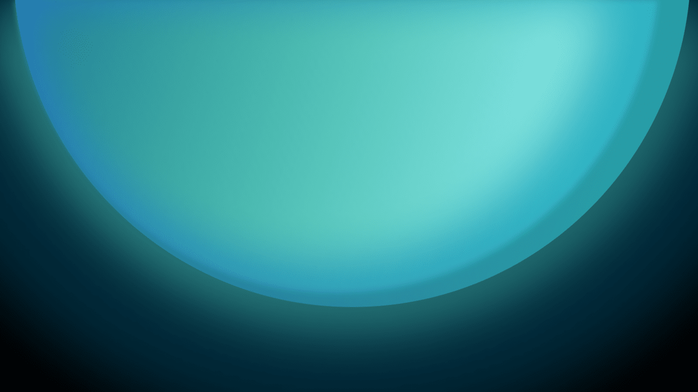
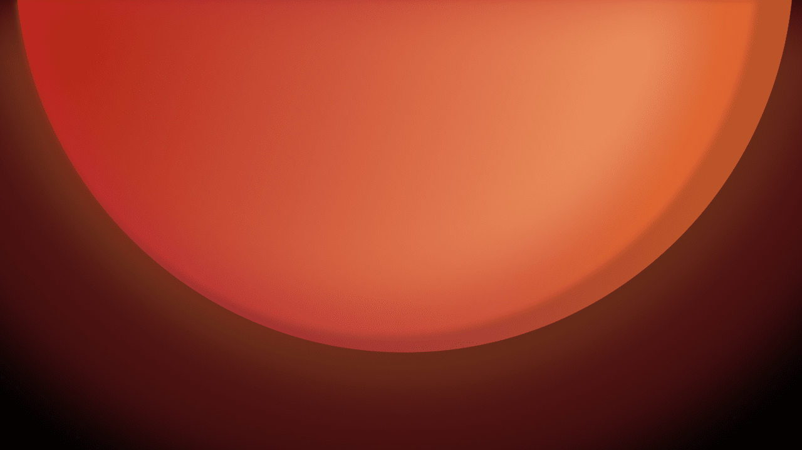
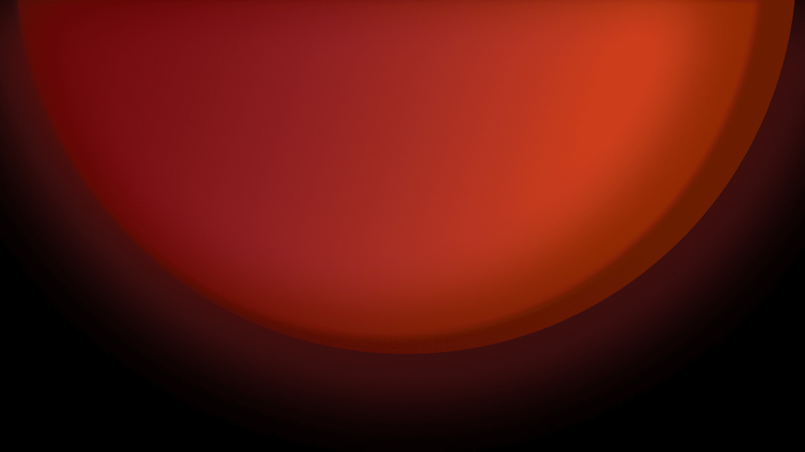
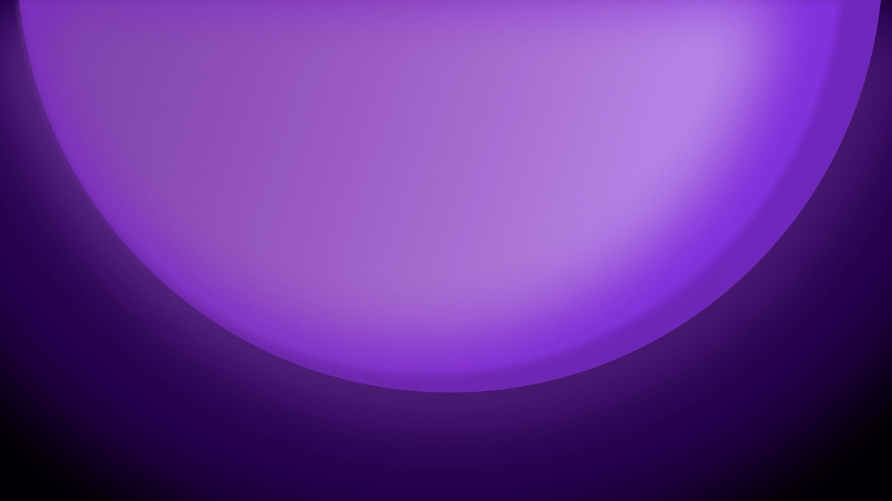
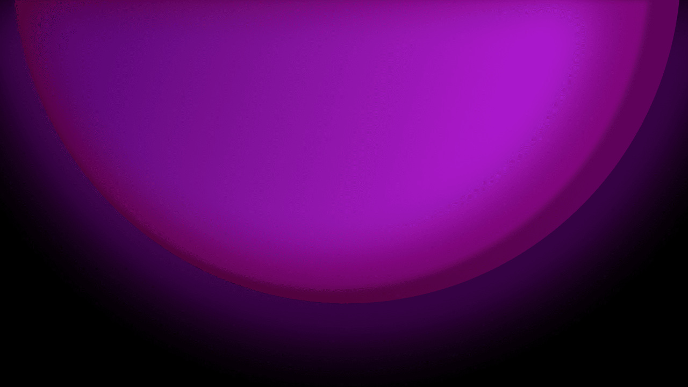

# Neptune Wallpapers
## About these wallpapers
I designed these wallpapers as part of the KDE Plasma 6 wallpaper competition. Neptune is designed to convey the theme of "**new beginnings**", which stems from the stated themes of trustworthiness, personal growth, and a reflection of me by being a new frontier that avoids the mistakes of the past and can be made into anything you want. It is designed with a glowing orb facing down at the bottom of the screen, highlighting the new floating-by-default panel in Plasma 6.
## Wallpapers
### Neptune (main)
This is the main wallpaper submitted as part of the contest. It features multiple shades of blue that come together to form a cohesive abstract orb - the name Neptune comes from Neptune being "*the blue planet*". It is available in light mode and dark mode.
#### Neptune Light

#### Neptune Dark

### Colour Variants
In addition to the primary blue colour, teal, orange and purple versions are available. I'm not officially submitting these as part of the contest, but they are there, and I don't have an issue with them being Teal as secondary options.
#### Neptune Teal
##### Light

#### Dark

#### Neptune Orange
##### Light

#### Dark

#### Neptune Purple
##### Light

#### Dark

### Vertical options
Neptune was designed horizontal-first, but it works great in vertical mode when rotated 90 degrees anti-clockwise. I can make versions with a more specific aspect ratio on request. 
